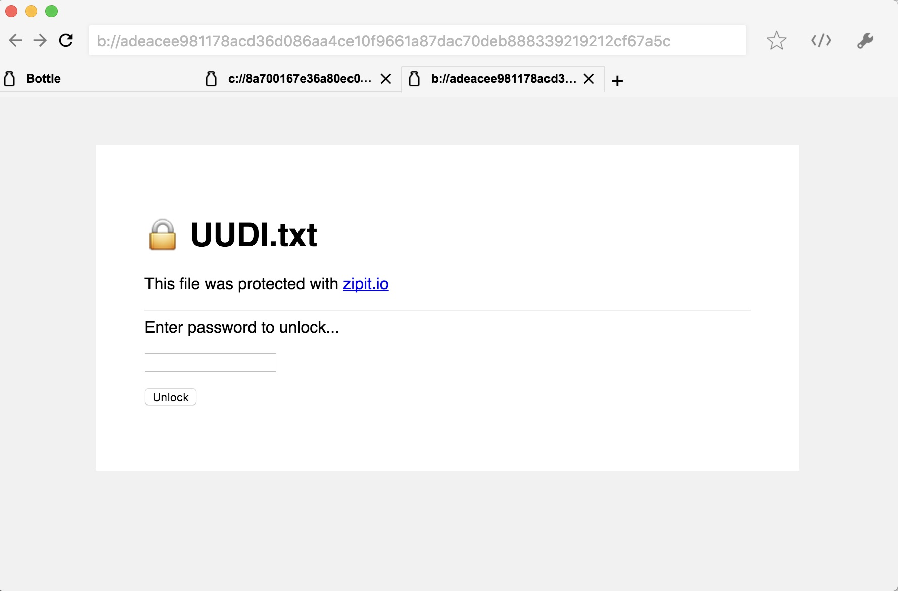

# Bottle

> A Bitcoin Browser


> Did you know that you can upload files directly to the Bitcoin network, as permanent, immutable, and monetizable Bitcoin transactions?
> 
> These files can be all sorts of things like documents, images, and videos, and can be combined to make other things, like applications or interactive pages.
> 
> With files, you can publish things that reference one another through URI schemes.
> 
> And because it's on the blockchain, ownership is provable, the content is permanent, and it can be directly monetized forever.

Bottle is a browser that lets you surf the Bitcoin network for these things, and brings them all together through Bitcoin native URI schemes such as [B://](https://b.bitdb.network) or [C://](https://c.bitdb.network) (or any other protocols we add in the future).

Note that the address bar below uses a b:// address:, not HTTP or HTTPS. This HTML file is 100% hosted and served from the Bitcoin blockchain, and has nothing to do with where a "server" is located.



# Download

You can download it at https://bottle.bitdb.network

# How it Works

Learn more about how it works at: https://bottle.bitdb.network

# Contribute

Contribution is welcome.

# How to Build

## 1. Download Electron

You can build from source. You need electron.

```
npm install -g electron
```

## 2. Install

Download the repository and install. First, clone it.

```
git clone https://github.com/interplanaria/bottle.git
```

Then install dependencies

```
cd bottle
npm install
```

## 3. Run

```
npm start
```

# How to Build Snap and AppImage on Linux

## 1. Download Electron-Builder

To build the packages we need to install electon-builder.

```
yarn add electron-builder --dev
```

## 2. Build

Download the repository and build. First, clone it.

```
git clone https://github.com/interplanaria/bottle.git
```

Then build the packages

```
cd bottle
npm run dist
```

## 3. Run

To execute the appImage.
```
./dist/Bottle_0.0.4.AppImage
```

To install the Snap.
```
sudo snap install ./dist/Bottle_0.0.4_amd64.snap --dangerous
```